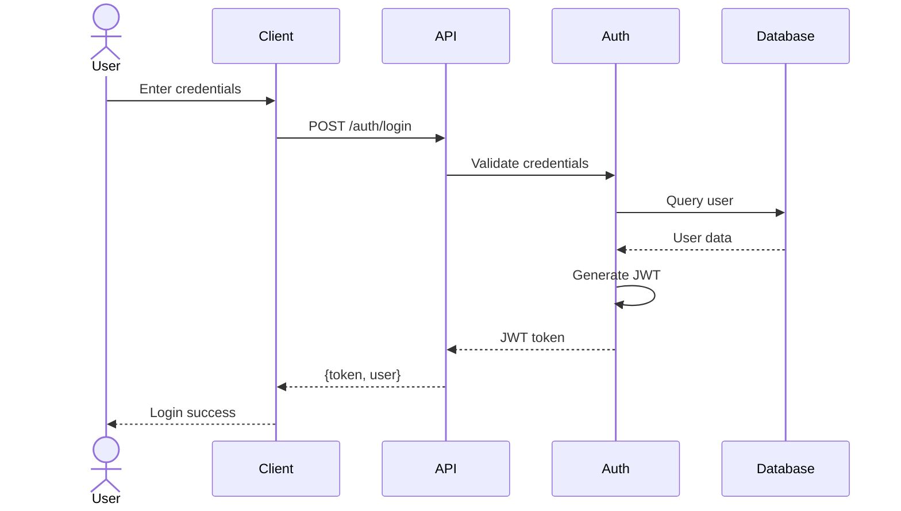

# Usage Guide - Claude Code Agent Skills

Complete guide on how to install and use the skills in your environment.

## 🚀 Quick Start

### Step 1: Install Skills

```bash
# Clone the repository
git clone https://github.com/ihiteshgupta/ClaudeSkills.git
cd ClaudeSkills

# Install all skills to Claude Code
mkdir -p ~/.config/claude/skills/
cp -r skills/* ~/.config/claude/skills/
```

### Step 2: Verify Installation

```bash
# List installed skills
ls ~/.config/claude/skills/

# You should see directories like:
# - react-expert/
# - mermaid-diagrams/
# - aws-architect/
# - kubernetes-expert/
# etc.

# Check a specific skill
cat ~/.config/claude/skills/react-expert/SKILL.md | head -20
```

### Step 3: Start Using!

Open Claude Code and start using the skills naturally. Claude will automatically detect and use the appropriate skill based on your request.

## 🎯 How Skills Work

### Automatic Skill Detection

Claude Code automatically:
1. Scans `~/.config/claude/skills/` on startup
2. Loads skill metadata (name and description)
3. Uses the appropriate skill based on your request
4. Injects the skill's instructions into context when needed

**You don't need to explicitly invoke skills** - just ask naturally!

## 💡 Usage Examples

### Example 1: Creating Diagrams

**Your request:**
```
Create a mermaid sequence diagram showing the authentication flow
with user login, JWT token generation, and API access
```

**What happens:**
- Claude detects you want a diagram
- Automatically uses `mermaid-diagrams` skill
- Generates proper mermaid syntax with best practices

**Result:**


### Example 2: AWS Architecture

**Your request:**
```
Design an AWS architecture for a scalable web application
with auto-scaling, load balancing, and RDS database
```

**What happens:**
- Claude detects AWS-related request
- Uses `aws-architect` skill
- Provides infrastructure code and diagrams

**Result:**
You'll get CloudFormation/Terraform code, architecture diagrams, and best practices.

### Example 3: React Component

**Your request:**
```
Create a React component with TypeScript that fetches user data,
handles loading states, and displays errors
```

**What happens:**
- Claude detects React development request
- Uses `react-expert` skill
- Provides modern React patterns with hooks

**Result:**
```typescript
import React, { useState, useEffect } from 'react';

interface User {
  id: string;
  name: string;
  email: string;
}

export const UserProfile: React.FC<{ userId: string }> = ({ userId }) => {
  const [user, setUser] = useState<User | null>(null);
  const [loading, setLoading] = useState(true);
  const [error, setError] = useState<Error | null>(null);

  useEffect(() => {
    const fetchUser = async () => {
      try {
        const response = await fetch(`/api/users/${userId}`);
        if (!response.ok) throw new Error('Failed to fetch user');
        const data = await response.json();
        setUser(data);
      } catch (err) {
        setError(err as Error);
      } finally {
        setLoading(false);
      }
    };

    fetchUser();
  }, [userId]);

  if (loading) return <div>Loading...</div>;
  if (error) return <div>Error: {error.message}</div>;
  if (!user) return <div>User not found</div>;

  return (
    <div>
      <h1>{user.name}</h1>
      <p>{user.email}</p>
    </div>
  );
};
```

### Example 4: Kubernetes Deployment

**Your request:**
```
Create a production-ready Kubernetes deployment for a Node.js API
with health checks, auto-scaling, and proper resource limits
```

**What happens:**
- Claude uses `kubernetes-expert` skill
- Provides production-ready manifests

### Example 5: System Design

**Your request:**
```
Design a microservices architecture for an e-commerce platform
with user service, product catalog, orders, and payments
```

**What happens:**
- Claude uses `system-design` skill
- Provides architecture diagrams, service breakdown, and data flow

### Example 6: Technical Documentation

**Your request:**
```
Write API documentation for a REST endpoint that creates a user
```

**What happens:**
- Claude uses `technical-writer` skill
- Creates comprehensive API docs with examples

## 🔍 Skill Locations

Claude Code searches for skills in this order:

1. **Project-level**: `.claude/skills/` (in your current project)
2. **User-level**: `~/.config/claude/skills/` (global for all projects)

### User-Level (Global)

```bash
# Install globally for all projects
cp -r skills/* ~/.config/claude/skills/
```

**Use when:** You want skills available across all your projects

### Project-Level (Local)

```bash
# Install for specific project only
cd /path/to/your/project
mkdir -p .claude/skills
cp -r /path/to/ClaudeSkills/skills/react-expert .claude/skills/
```

**Use when:**
- Project has specific requirements
- You want different skill versions per project
- Working in a team with shared skill configurations

## 🎨 Real-World Scenarios

### Scenario 1: Full-Stack Web App Development

**Install:**
```bash
cp -r skills/frontend/react-expert ~/.config/claude/skills/
cp -r skills/backend/nodejs-expert ~/.config/claude/skills/
cp -r skills/cloud/aws/aws-architect ~/.config/claude/skills/
cp -r skills/security/security-expert ~/.config/claude/skills/
```

**Use:**
- "Create a React dashboard with authentication"
- "Build a Node.js REST API with Express and PostgreSQL"
- "Deploy this app to AWS with ECS Fargate"
- "Add rate limiting and input validation for security"

### Scenario 2: Cloud Infrastructure Setup

**Install:**
```bash
cp -r skills/cloud/* ~/.config/claude/skills/
cp -r skills/devops/terraform ~/.config/claude/skills/
cp -r skills/kubernetes/kubernetes-expert ~/.config/claude/skills/
```

**Use:**
- "Create Terraform code for AWS VPC with public and private subnets"
- "Design a GKE cluster with auto-scaling node pools"
- "Set up Azure App Service with auto-scaling and monitoring"

### Scenario 3: Documentation & Diagrams

**Install:**
```bash
cp -r skills/documentation/technical-writer ~/.config/claude/skills/
cp -r skills/diagrams/mermaid-diagrams ~/.config/claude/skills/
```

**Use:**
- "Create a README for this API project"
- "Generate a sequence diagram for the payment flow"
- "Write a runbook for deploying this service"
- "Create an ERD for this database schema"

### Scenario 4: Security Audit

**Install:**
```bash
cp -r skills/security/security-expert ~/.config/claude/skills/
```

**Use:**
- "Review this code for SQL injection vulnerabilities"
- "Add authentication middleware with JWT"
- "Implement rate limiting for the login endpoint"
- "Check for OWASP Top 10 vulnerabilities"

## 🛠️ Platform-Specific Instructions

### macOS

```bash
# Skills directory
~/.config/claude/skills/

# Installation
cd ~/Downloads/ClaudeSkills  # or wherever you cloned
cp -r skills/* ~/.config/claude/skills/

# Verify
ls ~/.config/claude/skills/
```

### Linux (Ubuntu/Debian)

```bash
# Skills directory
~/.config/claude/skills/

# Installation
cd ~/ClaudeSkills
cp -r skills/* ~/.config/claude/skills/

# Fix permissions if needed
chmod -R 755 ~/.config/claude/skills/
```

### Windows (WSL)

```bash
# Skills directory
~/.config/claude/skills/

# Installation (same as Linux)
cd ~/ClaudeSkills
cp -r skills/* ~/.config/claude/skills/
```

### Windows (PowerShell)

```powershell
# Skills directory
$env:USERPROFILE\.config\claude\skills\

# Create directory
New-Item -ItemType Directory -Force -Path "$env:USERPROFILE\.config\claude\skills"

# Installation
Copy-Item -Recurse -Force ".\skills\*" "$env:USERPROFILE\.config\claude\skills\"

# Verify
Get-ChildItem "$env:USERPROFILE\.config\claude\skills\"
```

## ✅ Verification Checklist

After installation, verify everything is working:

```bash
# 1. Check skills directory exists
ls ~/.config/claude/skills/

# 2. Verify specific skill
cat ~/.config/claude/skills/mermaid-diagrams/SKILL.md | head -10

# 3. Check frontmatter is valid
head -6 ~/.config/claude/skills/react-expert/SKILL.md

# Should show:
# ---
# name: react-expert
# description: Expert in React...
# allowed-tools: Read, Write, Edit, Grep, Glob, Bash
# ---
```

## 🔧 Troubleshooting

### Issue: Skills not being used

**Check:**
```bash
# 1. Verify skills are in correct location
ls ~/.config/claude/skills/

# 2. Check SKILL.md exists
ls ~/.config/claude/skills/*/SKILL.md

# 3. Verify frontmatter
head -10 ~/.config/claude/skills/react-expert/SKILL.md
```

**Fix:**
```bash
# Reinstall skills
cp -r skills/* ~/.config/claude/skills/
```

### Issue: Permission denied

**Fix:**
```bash
chmod -R 755 ~/.config/claude/skills/
```

### Issue: Directory doesn't exist

**Fix:**
```bash
mkdir -p ~/.config/claude/skills/
cp -r skills/* ~/.config/claude/skills/
```

### Issue: Wrong location on Windows

**Fix (PowerShell):**
```powershell
New-Item -ItemType Directory -Force -Path "$env:USERPROFILE\.config\claude\skills"
Copy-Item -Recurse ".\skills\*" "$env:USERPROFILE\.config\claude\skills\"
```

## 📝 Tips for Best Results

### 1. Be Specific in Requests

**Good:**
```
Create a React component with TypeScript that manages a todo list
with add, delete, and complete functionality using hooks
```

**Less effective:**
```
Make a todo app
```

### 2. Mention Technology Explicitly

**Good:**
```
Design an AWS Lambda function with API Gateway for user registration
```

**Less effective:**
```
Create a serverless function
```

### 3. Combine Skills Naturally

**Request:**
```
Create a system design for a chat application, then generate
a mermaid architecture diagram showing the components
```

Claude will use both `system-design` and `mermaid-diagrams` skills!

## 🔄 Updating Skills

To update to the latest version:

```bash
cd ClaudeSkills
git pull origin main

# Update installed skills
cp -r skills/* ~/.config/claude/skills/
```

## 🎯 Next Steps

1. **Install the skills** using commands above
2. **Try examples** from this guide
3. **Experiment** with different requests
4. **Check individual skills** in `skills/*/SKILL.md` for detailed documentation
5. **Contribute** new skills following CONTRIBUTING.md

## 📚 Additional Resources

- **README.md** - Overview of all available skills
- **INSTALLATION.md** - Detailed installation options
- **SKILLS_CATALOG.md** - Complete skills catalog
- **CONTRIBUTING.md** - How to add new skills
- Individual **SKILL.md** files - Detailed documentation for each skill

## 💬 Support

If you have issues:

1. Check this guide's troubleshooting section
2. Verify installation with checklist above
3. Review individual skill SKILL.md files
4. Open an issue on GitHub

---

**Happy coding with Claude Code Agent Skills! 🚀**
