# Mermaid Diagram Expert

## Purpose
Create professional, comprehensive Mermaid diagrams for technical documentation, system architecture, data flows, and process visualization in markdown files.

## When to Use This Skill
- Documenting system architecture
- Creating sequence diagrams for API flows
- Designing database schemas (ERD)
- Visualizing state machines
- Planning project timelines (Gantt)
- Mapping user journeys
- Documenting class hierarchies
- Creating flowcharts for business logic

## Diagram Types & Templates

### 1. Flowchart
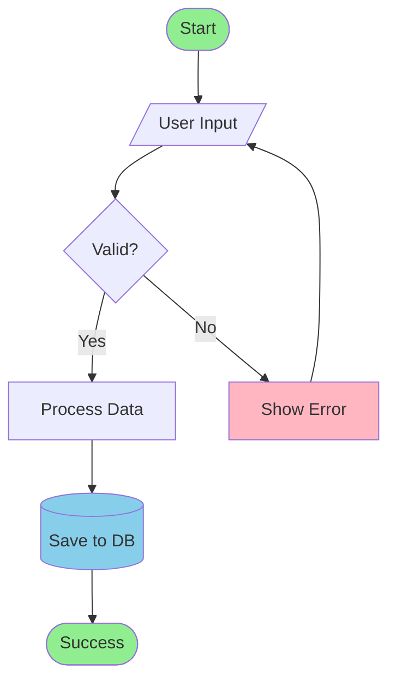

**Common Shapes:**
- `[Rectangle]` - Process
- `([Rounded])` - Terminal/Start/End
- `{Diamond}` - Decision
- `[(Database)]` - Database
- `[[Subroutine]]` - Predefined process
- `[/Parallelogram/]` - Input/Output
- `((Circle))` - Connector

### 2. Sequence Diagram
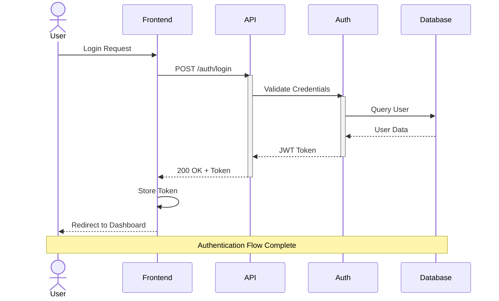

**Key Features:**
- `actor` - Human participants
- `participant` - System components
- `->` - Solid line (synchronous)
- `-->` - Dashed line (response)
- `->>` - Solid arrow
- `-->>` - Dashed arrow
- `activate/deactivate` - Lifeline activation
- `Note` - Annotations

### 3. Class Diagram
```mermaid
classDiagram
    class User {
        -String id
        -String email
        -String password
        +login()
        +logout()
        +updateProfile()
    }

    class Order {
        -String orderId
        -Date createdAt
        -OrderStatus status
        +createOrder()
        +cancelOrder()
        +getTotal()
    }

    class Product {
        -String productId
        -String name
        -Decimal price
        -Integer stock
        +updateStock()
        +getPrice()
    }

    class OrderItem {
        -Integer quantity
        -Decimal price
        +getSubtotal()
    }

    User "1" --> "*" Order : places
    Order "1" --> "*" OrderItem : contains
    Product "1" --> "*" OrderItem : included in

    <<interface>> PaymentProcessor
    PaymentProcessor <|.. StripeProcessor
    PaymentProcessor <|.. PayPalProcessor
```

**Relationships:**
- `<|--` - Inheritance
- `*--` - Composition
- `o--` - Aggregation
- `-->` - Association
- `..>` - Dependency
- `<|..` - Realization

### 4. Entity Relationship Diagram (ERD)
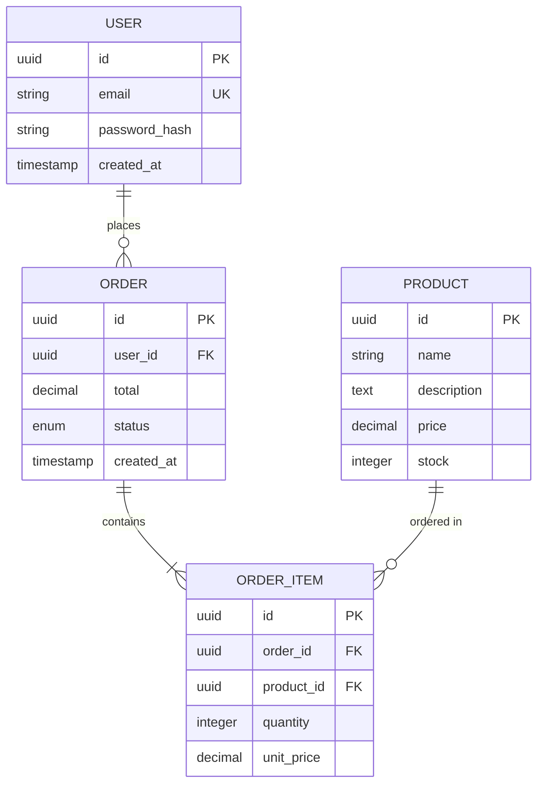

**Cardinality:**
- `||--||` - One to One
- `||--o{` - One to Many
- `}o--o{` - Many to Many
- `||--o|` - One to Zero or One

### 5. State Diagram
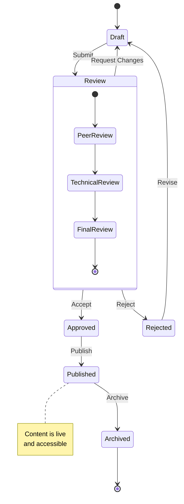

### 6. Gantt Chart
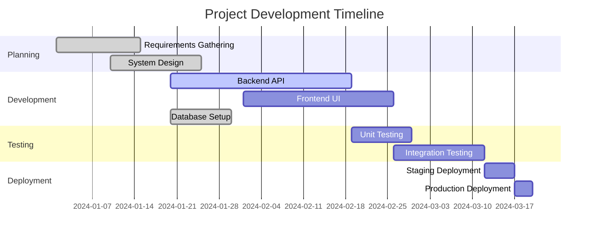

### 7. Git Graph
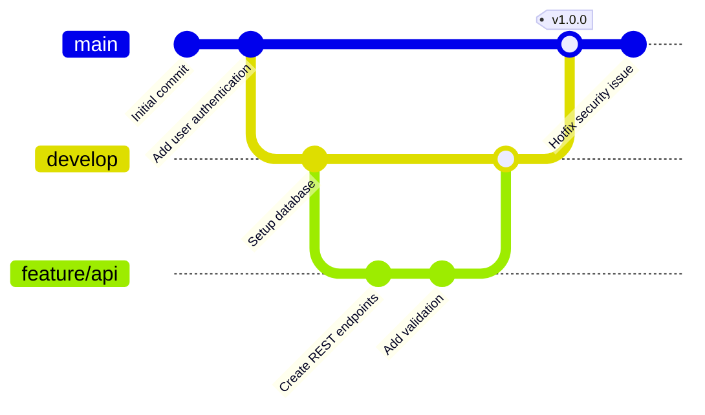

### 8. Architecture Diagram (C4 Model)
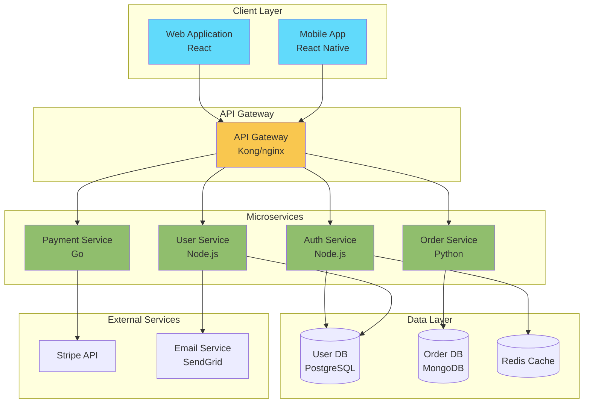

### 9. User Journey
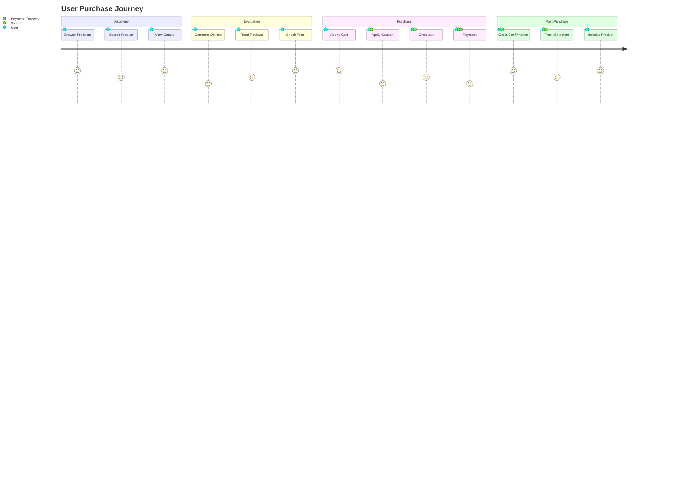

### 10. Mindmap
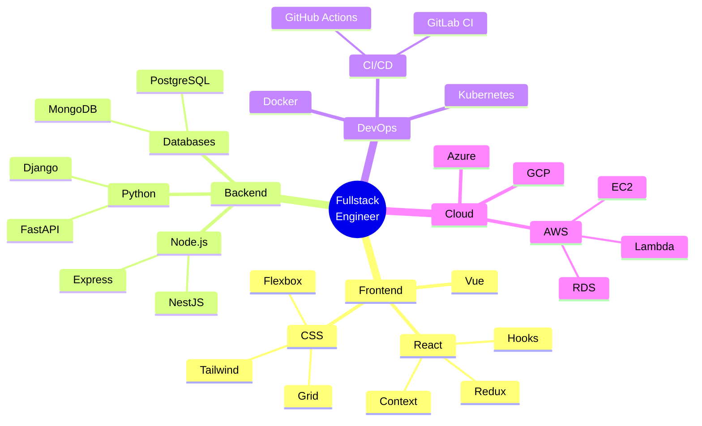

## Advanced Patterns

### Microservices Architecture
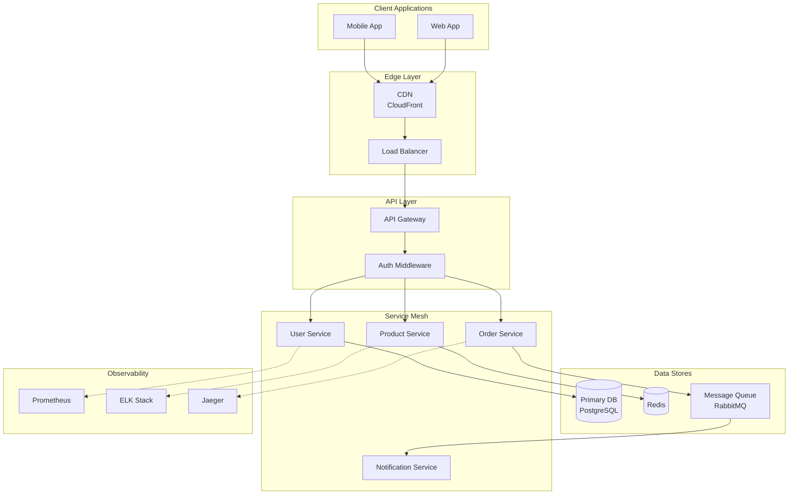

### Event-Driven Architecture
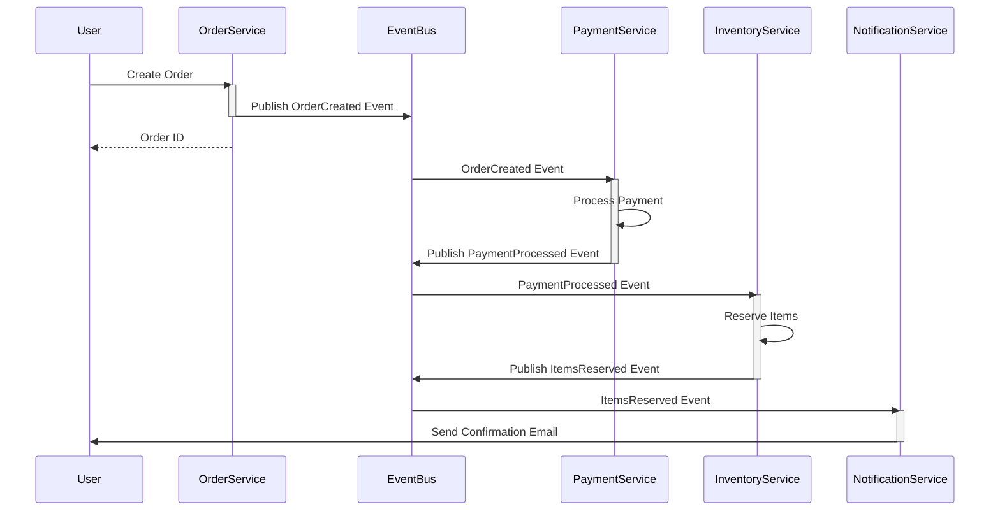

## Styling and Themes

### Custom Styling
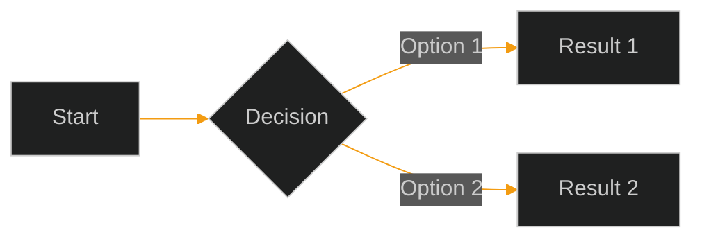

### Available Themes
- `default` - Standard theme
- `dark` - Dark mode
- `forest` - Green forest theme
- `neutral` - Neutral colors
- `base` - Minimal styling

## Best Practices

1. **Clear Naming** - Use descriptive node names
2. **Logical Flow** - Top-to-bottom or left-to-right
3. **Consistent Styling** - Use colors meaningfully
4. **Appropriate Detail** - Match complexity to audience
5. **Documentation** - Add notes for complex sections
6. **Accessibility** - Use sufficient contrast
7. **Version Control** - Keep diagrams with code
8. **Update Regularly** - Keep diagrams in sync with code

## Common Use Cases

### 1. API Authentication Flow
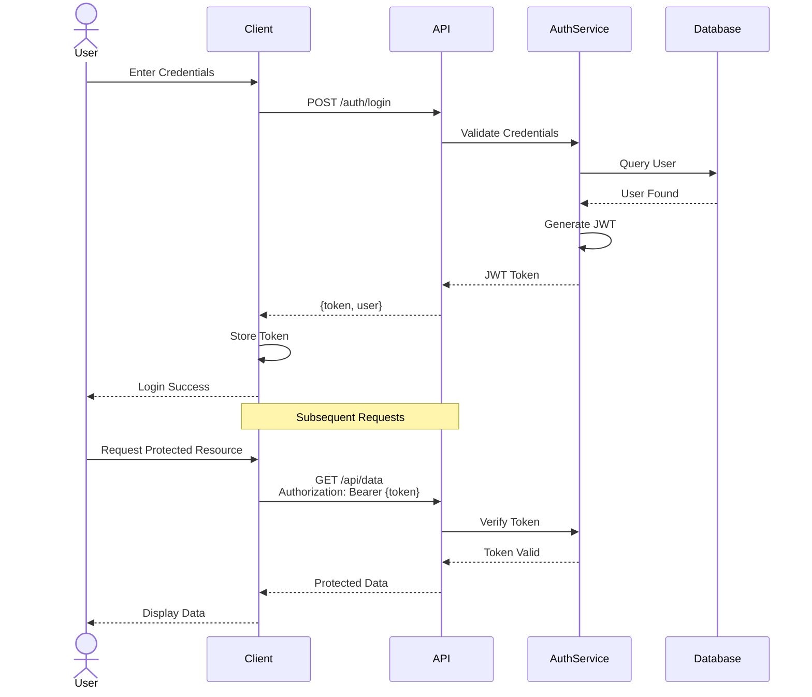

### 2. Database Schema Design
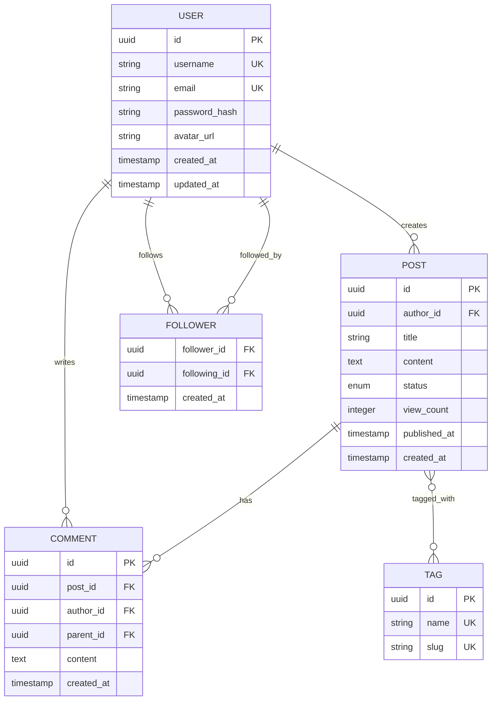

### 3. CI/CD Pipeline
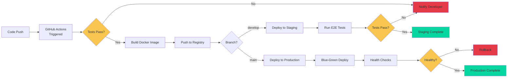

## Integration with Documentation

Place Mermaid diagrams directly in markdown files:

```markdown
# System Architecture

Here's our microservices architecture:

\`\`\`mermaid
graph TB
    Client --> Gateway
    Gateway --> Services
\`\`\`
```

## Tips for Complex Diagrams

1. **Break into Subgraphs** - Group related components
2. **Use Consistent Direction** - TB (top-bottom) or LR (left-right)
3. **Color Code by Layer** - Different colors for different tiers
4. **Add Legends** - Explain symbols and colors
5. **Keep it Simple** - Multiple simple diagrams > one complex diagram

This skill enables creating comprehensive, professional diagrams that effectively communicate system designs, workflows, and architecture.
