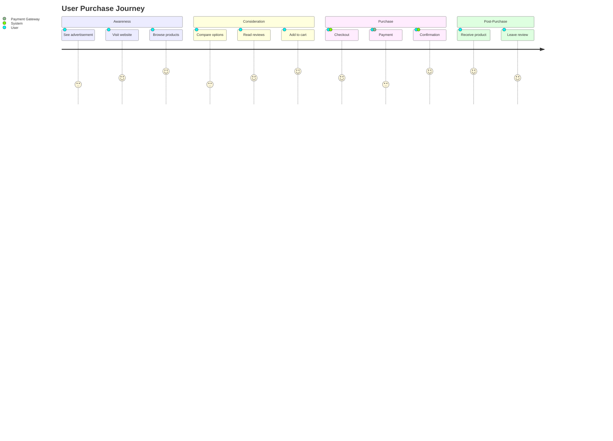

# UX/UI Design Expert

## Purpose
Provide expert guidance on user experience design, user research, information architecture, wireframing, prototyping, and design systems.

## When to Use This Skill
- Designing user interfaces
- Creating user flows and journeys
- Wireframing and prototyping
- Accessibility design (WCAG compliance)
- Design system creation
- User research and testing
- Information architecture
- Responsive design patterns

## UX Design Process

### 1. Research Phase
```
User Research Methods:
- User interviews
- Surveys and questionnaires
- Analytics analysis
- Competitive analysis
- User personas
- Journey mapping
```

### 2. Information Architecture
```
Sitemap Example:

Home
├── Products
│   ├── Category A
│   ├── Category B
│   └── Search
├── About
│   ├── Team
│   └── Contact
├── Resources
│   ├── Blog
│   └── Documentation
└── Account
    ├── Dashboard
    ├── Settings
    └── Orders
```

### 3. User Personas
```markdown
## Persona: Tech-Savvy Developer

**Demographics:**
- Age: 28-35
- Occupation: Software Engineer
- Tech proficiency: High

**Goals:**
- Quick access to documentation
- Code examples and samples
- API reference

**Pain Points:**
- Poorly documented APIs
- Lack of code examples
- Slow search functionality

**Behaviors:**
- Uses keyboard shortcuts
- Prefers dark mode
- Values efficiency
```

### 4. User Journey Map


### 5. Wireframing

**Low-Fidelity Wireframe (ASCII)**
```
+----------------------------------+
|  Logo    [Search]    Login       |
+----------------------------------+
|                                  |
|  [Hero Image/Banner]             |
|  Main Headline                   |
|  Subheadline                     |
|  [CTA Button]                    |
|                                  |
+----------------------------------+
|  Feature 1  |  Feature 2  |  F3  |
|  [Icon]     |  [Icon]     |  [I] |
|  Text       |  Text       |  Txt |
+----------------------------------+
|  Footer Links  |  Social  | Copy |
+----------------------------------+
```

## Design Patterns

### 1. Navigation Patterns
```
Top Navigation (Desktop):
Logo | Products | Features | Pricing | About | Login

Mobile Navigation (Hamburger):
☰ Menu
  → Home
  → Products
  → Features
  → Pricing
  → About
```

### 2. Forms Best Practices
```html
<!-- Good UX -->
<form>
  <label for="email">Email Address</label>
  <input
    type="email"
    id="email"
    name="email"
    placeholder="you@example.com"
    required
    aria-describedby="email-help"
  />
  <span id="email-help">We'll never share your email</span>

  <button type="submit">Sign Up</button>
</form>

Principles:
- Clear labels above inputs
- Helper text when needed
- Inline validation
- Disabled submit until valid
- Clear error messages
```

### 3. Card Component Design
```
┌────────────────────────┐
│  [Image]               │
│                        │
├────────────────────────┤
│  Title                 │
│  Description text that │
│  spans multiple lines  │
│                        │
│  [Tag] [Tag]          │
│                        │
│  [Button]  [Link]      │
└────────────────────────┘
```

## Accessibility (WCAG 2.1)

### Level AA Requirements

**1. Perceivable**
```
- Color contrast ratio ≥ 4.5:1 for text
- Alt text for images
- Captions for videos
- Don't rely on color alone
```

**2. Operable**
```
- Keyboard navigable
- No keyboard traps
- Sufficient time limits
- Skip navigation links
```

**3. Understandable**
```
- Clear error messages
- Consistent navigation
- Predictable behavior
- Input assistance
```

**4. Robust**
```
- Valid HTML
- ARIA attributes
- Screen reader compatible
```

### Accessible Form Example
```html
<form aria-labelledby="form-title">
  <h2 id="form-title">Contact Form</h2>

  <div role="group" aria-labelledby="name-label">
    <label id="name-label" for="name">
      Full Name <span aria-label="required">*</span>
    </label>
    <input
      type="text"
      id="name"
      name="name"
      required
      aria-required="true"
      aria-invalid="false"
      aria-describedby="name-error"
    />
    <span id="name-error" role="alert" hidden>
      Please enter your name
    </span>
  </div>

  <button type="submit" aria-label="Submit contact form">
    Submit
  </button>
</form>
```

## Design Systems

### Component Catalog
```
Atoms:
- Button (primary, secondary, tertiary)
- Input
- Label
- Icon
- Badge

Molecules:
- Form field (label + input + error)
- Card header
- Navigation item

Organisms:
- Header
- Card
- Form
- Navigation bar

Templates:
- Dashboard layout
- Content page
- Landing page
```

### Design Tokens
```json
{
  "colors": {
    "primary": {
      "50": "#f0f9ff",
      "500": "#3b82f6",
      "900": "#1e3a8a"
    },
    "neutral": {
      "50": "#f9fafb",
      "500": "#6b7280",
      "900": "#111827"
    }
  },
  "spacing": {
    "xs": "0.25rem",
    "sm": "0.5rem",
    "md": "1rem",
    "lg": "1.5rem",
    "xl": "2rem"
  },
  "typography": {
    "fontFamily": {
      "sans": ["Inter", "system-ui", "sans-serif"],
      "mono": ["'Fira Code'", "monospace"]
    },
    "fontSize": {
      "xs": "0.75rem",
      "sm": "0.875rem",
      "base": "1rem",
      "lg": "1.125rem",
      "xl": "1.25rem",
      "2xl": "1.5rem"
    }
  },
  "borderRadius": {
    "sm": "0.125rem",
    "md": "0.375rem",
    "lg": "0.5rem",
    "full": "9999px"
  }
}
```

## Responsive Design

### Breakpoints
```css
/* Mobile first approach */
.container {
  padding: 1rem;
}

/* Tablet (768px+) */
@media (min-width: 768px) {
  .container {
    padding: 2rem;
  }
}

/* Desktop (1024px+) */
@media (min-width: 1024px) {
  .container {
    padding: 3rem;
    max-width: 1200px;
    margin: 0 auto;
  }
}
```

### Mobile-First Grid
```
Mobile (1 column):
┌──────────┐
│  Item 1  │
├──────────┤
│  Item 2  │
├──────────┤
│  Item 3  │
└──────────┘

Tablet (2 columns):
┌─────────┬─────────┐
│ Item 1  │ Item 2  │
├─────────┼─────────┤
│ Item 3  │         │
└─────────┴─────────┘

Desktop (3 columns):
┌──────┬──────┬──────┐
│Item 1│Item 2│Item 3│
└──────┴──────┴──────┘
```

## Micro-interactions

```
Button Click Animation:
1. Initial state
2. Pressed (scale 0.95)
3. Loading (spinner)
4. Success (checkmark + green)

Toast Notification:
1. Slide in from top
2. Display for 3s
3. Fade out

Form Validation:
1. Input blur
2. Validate
3. Show error (shake + red border)
4. Fix input
5. Show success (green border + checkmark)
```

## UX Metrics

```
Key Metrics:
- Task Success Rate
- Time on Task
- Error Rate
- System Usability Scale (SUS)
- Net Promoter Score (NPS)
- Conversion Rate
- Bounce Rate
```

## Best Practices

1. **Progressive Disclosure** - Show information when needed
2. **Feedback** - Immediate system response
3. **Consistency** - Similar UI patterns
4. **Forgiveness** - Easy undo/redo
5. **Clarity** - Clear language and visuals
6. **Efficiency** - Keyboard shortcuts, autofill
7. **Accessibility** - WCAG AA compliance
8. **Mobile-First** - Design for smallest screen first

This skill ensures user-centered, accessible, and delightful design.
